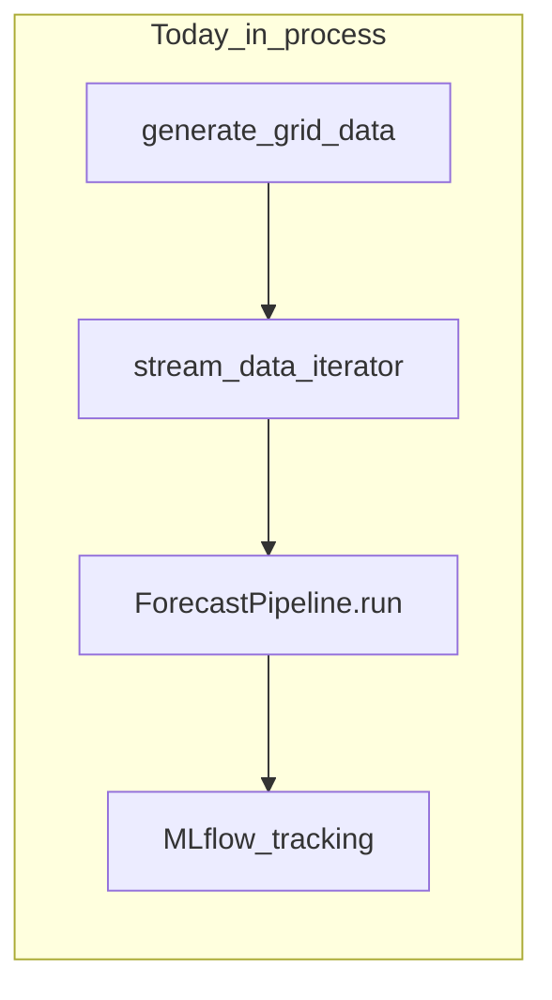
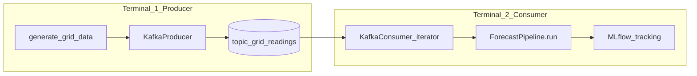

# Kafka Integration — Phased Learning Plan

## Should you branch off?

**Yes — branch from `main`.** Recommended name: `feature/kafka-streaming`.

| Stay on `main` | Work on a feature branch |
|---|---|
| `make streaming` keeps working as today | You can break things while learning without guilt |
| No new dependencies for collaborators | Kafka deps stay optional until the branch merges |
| Clean history | Each phase = one small commit you can study |

`main` today is a complete **in-process** streaming demo. Kafka is an **alternate data source** for the same pipeline — not a rewrite. Keeping that on a branch until it runs end-to-end matches how you'd integrate a new ingress path at Neo4j without destabilizing the baseline.

There is **no existing Kafka branch** in this repo (project context mentions a reverted prototype that was never pushed). You are building fresh, which is fine — the pipeline abstraction is already correct.

---

## What we are doing (big picture)

Today, data flows like this:



After Kafka integration, data flows like this:



**The only architectural change:** replace [`data_simulation/stream.py`](data_simulation/stream.py) (`stream_data`) with a Kafka-backed iterator when you want broker-based streaming. Everything below that line stays the same:

- [`pipeline/forecasting_pipeline.py`](pipeline/forecasting_pipeline.py) — `run(stream)` loop, bounded `deque`, drift, graceful SIGINT
- [`monitoring/drift.py`](monitoring/drift.py) — unchanged
- [`models/training.py`](models/training.py) — unchanged (keep `save_model` + `log_artifacts` pattern)
- MLflow — unchanged

This is deliberate **separation of concerns**: Kafka handles *transport*; your pipeline handles *ML logic*.

---

## Why this maps to Neo4j customer work

At Neo4j you will hear: "events arrive on Kafka, something downstream reacts." Your repo is a miniature version:

- **Topic** = enterprise event channel (CDC, IoT readings, transactions)
- **Producer** = system that emits events (DB connector, sensor gateway)
- **Consumer** = your service (here: forecast + drift + retrain; at a customer: graph projection, enrichment, fraud scoring)
- **Consumer group** = scaled or restarted workers that share load
- **Offsets** = replay / recovery — reprocess history after you change logic

You are not building a graph yet. You are learning the **event backbone** that many Neo4j deployments sit downstream of.

---

## Phase 0 — Branch and baseline (15 min, no Kafka code)

**Goal:** Confirm the existing demo still runs; create the branch.

**Steps:**
1. On `main`: `make mlflow-server` (terminal 1) and `make streaming` (terminal 2)
2. Watch a few lines: `Actual X | Pred Y | Error Z`
3. Optionally trigger drift (high error → `Drift detected -> retraining`)
4. Ctrl+C once → run ends with `status=KILLED`, no model registration
5. `git checkout -b feature/kafka-streaming`

**What you learn:** The **contract** the Kafka consumer must satisfy. Each `obs` in the loop must look like a DataFrame row with at least `load`, `temperature`, and ideally `timestamp` — same shape [`generate_grid_data()`](data_simulation/generator.py) produces.

---

## Phase 1 — Broker only (30–45 min, Docker, zero Python changes)

**Goal:** Run a Kafka-compatible broker locally and produce/consume manually.

**Default choice:** Redpanda in Docker (Kafka-compatible API, one container, includes Console UI). Apache Kafka works too — client code is identical.

**Add to repo (on branch):**
- [`docker-compose.yml`](docker-compose.yml) — Redpanda + Console
- [`Makefile`](Makefile) target: `make kafka-up` / `make kafka-down`
- Short doc section in README (or a `docs/kafka-learning.md` if you prefer not to touch README yet)

**Manual verification (before any project code):**
1. `make kafka-up`
2. Open Console UI (typically `http://localhost:8080`)
3. Create topic `grid-readings` (1 partition for learning — ordering is simple)
4. Use Console "Produce Message" to send one JSON record
5. Use Console "Consume" to read it back

**Concepts to internalize:**

| Term | Meaning in this project |
|---|---|
| **Topic** | Named channel `grid-readings` — all grid observations go here |
| **Partition** | Single ordered log slice; start with 1 partition so order is global |
| **Offset** | Index of each message (0, 1, 2…) — bookmark for replay |
| **Broker** | Redpanda container — stores the log |
| **Retention** | How long messages survive after consumers read them (hours/days) |

**Checkpoint:** You can create a topic and see a message in the UI without touching Python.

---

## Phase 2 — Standalone producer script (45–60 min)

**Goal:** Replace the *first half* of `run_streaming.py` with a real Kafka producer.

**New file:** [`run_kafka_producer.py`](run_kafka_producer.py) (top-level, like [`run_streaming.py`](run_streaming.py))

**Logic (mirrors current flow):**
```python
data = generate_grid_data()
for _, row in data.iterrows():
    producer.send("grid-readings", key=b"zone-1", value=json_payload)
    optional sleep(delay)  # reuse pacing idea from stream_data
producer.flush()
```

**New config** in [`config/settings.py`](config/settings.py):
- `KAFKA_BOOTSTRAP_SERVERS` (default `localhost:9092`)
- `KAFKA_TOPIC` (default `grid-readings`)
- `KAFKA_PRODUCER_DELAY` (default `0.0`; set `0.05` for visible real-time demo)

**Dependency:** add optional group in [`pyproject.toml`](pyproject.toml):
```toml
[project.optional-dependencies]
kafka = ["confluent-kafka>=2.3.0"]
```
Install with: `pip install -e ".[kafka]"`

**Why `confluent-kafka`:** Production-grade C-backed client; same API customers use. Alternative `kafka-python` is pure Python and easier to debug but less common in enterprise.

**Checkpoint:** Run producer → messages appear in Console. [`run_streaming.py`](run_streaming.py) on `main` is untouched; this branch only adds a new entry point.

---

## Phase 3 — Kafka stream iterator (60–75 min) — the core integration

**Goal:** Write the adapter that makes Kafka look like `stream_data()` to the pipeline.

**New file:** [`data_simulation/kafka_stream.py`](data_simulation/kafka_stream.py)

**Function signature:**
```python
def stream_from_kafka(
    topic: str,
    bootstrap_servers: str,
    group_id: str,
    auto_offset_reset: str = "earliest",
) -> Iterator[dict]:
    ...
```

**Each yielded observation:**
```python
{
    "timestamp": pd.Timestamp(...),  # parsed from JSON
    "load": float,
    "temperature": float,
}
```
Must match what [`ForecastPipeline.ingest`](pipeline/forecasting_pipeline.py) expects when wrapped in `pd.DataFrame`.

**Design decisions (explained):**

1. **Iterator, not a class** — matches [`stream_data`](data_simulation/stream.py); `ForecastPipeline.run(stream)` stays generic.

2. **`group_id`** — e.g. `forecast-pipeline-dev`. Same group + restart = resume from last committed offset. New group + `earliest` = full replay (great for re-running ML experiments).

3. **`auto_offset_reset=earliest`** for learning — consumer reads from the beginning if no offset exists. For "live only" later, switch to `latest`.

4. **Graceful shutdown** — on SIGINT, close consumer and commit offsets. Your pipeline already handles SIGINT at the MLflow layer; the consumer should close cleanly in a `finally` or via context manager.

5. **Do not put ML logic here** — this file only polls Kafka and yields dicts. Drift, retrain, MLflow stay in [`forecasting_pipeline.py`](pipeline/forecasting_pipeline.py).

6. **Update setuptools** — add `data_simulation` is already listed; no package rename needed. If you add a `kafka` subpackage later, register it in [`pyproject.toml`](pyproject.toml) `[tool.setuptools] packages`.

**Minimal test before wiring pipeline:**
```python
for obs in stream_from_kafka(...):
    print(obs["load"])
    break  # one message
```

**Checkpoint:** Iterator yields real observations from the topic you produced in Phase 2.

---

## Phase 4 — Consumer entry point (30 min)

**Goal:** New script that is to Kafka what [`run_streaming.py`](run_streaming.py) is to the in-memory iterator.

**New file:** [`run_streaming_kafka.py`](run_streaming_kafka.py)

```python
stream = stream_from_kafka(
    topic=KAFKA_TOPIC,
    bootstrap_servers=KAFKA_BOOTSTRAP_SERVERS,
    group_id="forecast-pipeline-dev",
)
pipeline = ForecastPipeline()
pipeline.run(stream)
# same was_killed / register_best_model logic as run_streaming.py
```

**Makefile target:** `make streaming-kafka` (documents the two-terminal workflow)

**Two-terminal workflow:**
```bash
# Terminal 0
make mlflow-server

# Terminal 1
make kafka-up

# Terminal 2
python run_kafka_producer.py

# Terminal 3
python run_streaming_kafka.py
```

**Checkpoint:** Full path — synthetic data → Kafka → forecast → drift → MLflow — works end-to-end.

---

## Phase 5 — Learning exercises (optional, 30–45 min)

These deepen understanding without much new code:

1. **Replay:** Stop consumer, run producer again (or use existing messages), start consumer with **new** `group_id` and `earliest` — watch full history reprocessed.

2. **Resume:** Restart with **same** `group_id` — continues where it left off.

3. **Pacing:** Set `KAFKA_PRODUCER_DELAY=0.1` — correlate produce rate with consumer print rate.

4. **Second consumer group:** Small script that only prints `load` — same topic, independent offset cursor (pub/sub at the log layer).

5. **Partitioning preview:** Change key to `zone-1` / `zone-2`, increase partitions to 2 — observe messages split across partitions in Console (ordering is per-partition only).

---

## What we deliberately do NOT do (yet)

Keeps scope learnable and avoids regressions:

- No changes to [`ForecastPipeline.buffer`](pipeline/forecasting_pipeline.py) — stays `deque(maxlen=BUFFER_SIZE)`
- No per-retrain `log_model` — keep [`models/training.py`](models/training.py) pattern
- No Schema Registry / Avro — JSON is enough for learning
- No exactly-once semantics — at-least-once is fine for this demo
- No Neo4j connector — out of scope; Phase 5 exercise 4 is the conceptual bridge
- No merge to `main` until you have run the two-terminal workflow at least once

---

## File change summary

| File | Action | Phase |
|---|---|---|
| `docker-compose.yml` | Create | 1 |
| `Makefile` | Add `kafka-up`, `kafka-down`, `streaming-kafka` | 1, 4 |
| `pyproject.toml` | Add `[kafka]` optional deps | 2 |
| `config/settings.py` | Add Kafka env vars | 2 |
| `run_kafka_producer.py` | Create | 2 |
| `data_simulation/kafka_stream.py` | Create | 3 |
| `run_streaming_kafka.py` | Create | 4 |
| `.cursor/rules/project-context.mdc` | Update run instructions | 4 |
| `pipeline/forecasting_pipeline.py` | **No changes** | — |
| `run_streaming.py` | **No changes** | — |

---

## Suggested commit sequence on the branch

One commit per phase — easy to `git log` and study:

1. `chore: add Redpanda docker-compose and make targets`
2. `feat: add Kafka producer for synthetic grid readings`
3. `feat: add stream_from_kafka iterator adapter`
4. `feat: add run_streaming_kafka entry point and docs`

---

## How you will know you are done

- [ ] `main` still runs `make streaming` unchanged
- [ ] Branch runs producer + consumer in separate terminals
- [ ] MLflow shows prediction/error metrics from Kafka-sourced run
- [ ] You can explain topic, offset, consumer group using your own scripts
- [ ] You can draw the before/after diagram from memory

---

## Recommended order of work when you switch to Agent mode

Implement strictly in phase order. Do not skip to Phase 4 before Phase 1 works in the UI — each phase validates one layer:

**Broker → Producer → Iterator → Consumer entry point**

That mirrors how you would integrate Kafka at a customer: prove connectivity first, then wire the application.
