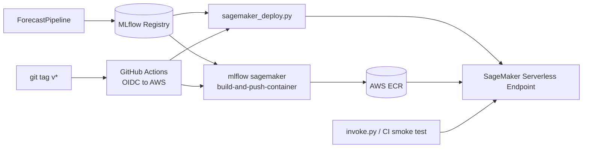

# SageMaker Deployment - Phased Plan

## Branching decision

**Merge `feature/kafka-streaming` into `main` first, then branch `feature/sagemaker-deploy` from `main`.**

Verified state:
- `feature/kafka-streaming` is 5 commits ahead of `main`, fast-forwardable, working tree clean.
- All MLflow artifacts (`mlruns/`, `mlartifacts/`) are gitignored, so models stay local regardless of branch.
- Kafka plan in [.cursor/plans/kafka_integration_plan_07495378.plan.md](.cursor/plans/kafka_integration_plan_07495378.plan.md) marks every phase `completed`.

SageMaker work is net-new infrastructure (a `deployment/` package + CI workflows). It does not depend on Kafka and should not stack on top of an unmerged feature branch.

## What does and does not change

**Untouched files (this is deliberate separation of concerns):**
- [pipeline/forecasting_pipeline.py](pipeline/forecasting_pipeline.py)
- [models/registry.py](models/registry.py) - `register_best_model` remains the single source of truth for "what gets deployed"
- [run_streaming.py](run_streaming.py), [run_streaming_kafka.py](run_streaming_kafka.py)
- Drift detection, Kafka adapter, MLflow tracking

**Only existing-file change:** pin pip versions in [models/training.py](models/training.py) lines 37-42 so SageMaker installs reproducible deps.



## Phase 0 - Branch, AWS hygiene, registered model check (~$0, 90-120 min)

**Region for all AWS work:** `ap-southeast-2` (Sydney). Closer to Melbourne -> lower endpoint latency, every service we need is available, ~5-10% pricier than us-east-1 but total cost still under $5.

### 0.1 Git branch
1. `git checkout main && git pull && git merge --ff-only feature/kafka-streaming && git push`
2. `git checkout -b feature/sagemaker-deploy`

### 0.2 Lock down the root account (~15 min)

Currently you sign in as root. From this point forward, **root should only ever be used for the four or five things that strictly require it** (closing the account, changing the support plan, restoring a deleted IAM user). Everything else goes through an IAM admin user.

1. Sign in as root once -> **My Security Credentials** -> enable **MFA** (virtual MFA app like 1Password / Authy / Google Authenticator). Non-negotiable.
2. Confirm no root access keys exist; if any are present, **delete them**.
3. Sign out as root.

### 0.3 Create an IAM admin user with MFA (~15 min)

1. As root one more time -> **IAM** -> **Users** -> **Create user**.
   - Name: e.g. `julio-admin`
   - Enable **AWS Management Console access** with a custom password.
2. Attach policy directly: `AdministratorAccess`.
3. After creation, open the user -> **Security credentials** -> assign **MFA**.
4. **Security credentials** -> **Create access key** -> "Command Line Interface" -> save the access key id + secret. These are what `aws configure` will use.
5. Sign out as root. From now on, sign in as `julio-admin`.

### 0.4 AWS CLI configured against ap-southeast-2

```bash
aws configure
# AWS Access Key ID:     <julio-admin access key>
# AWS Secret Access Key: <julio-admin secret>
# Default region name:   ap-southeast-2
# Default output format: json

aws sts get-caller-identity
# Expect: Arn ending in user/julio-admin, NOT user/root
```

### 0.5 Budget alarm (~5 min)

In the console: **Billing and Cost Management** -> **Budgets** -> **Create budget** -> Zero-spend template OR fixed $10/month, email notification at 50%, 80%, 100% actual spend. Non-negotiable before any deploy.

### 0.6 SageMaker execution role (~10 min)

In **IAM** -> **Roles** -> **Create role**:
- Trusted entity: **AWS service** -> **SageMaker**.
- Permissions: `AmazonSageMakerFullAccess` (Phase 4 will tighten this later if you want).
- Name: `SageMakerExecutionRole-TimeSeries`.
- After creation, attach an inline policy granting read/write to a new bucket `mlflow-artifacts-<suffix>` (the bucket itself we create in Phase 6 only if needed). For now, the `AmazonS3FullAccess` managed policy is fine for learning.
- Save the role ARN; you will paste it into [deployment/sagemaker_deploy.py](deployment/sagemaker_deploy.py) in Phase 4.

### 0.7 Verify the registered model exists

Open the MLflow UI -> **Models** tab -> confirm at least one version of `TimeSeries-GradientBoosting` exists with `current_stage=Production`. If not:
1. Run `make streaming-kafka` to completion (so `register_best_model` fires).
2. Transition the latest version to `Production` (UI button, or `MlflowClient.transition_model_version_stage`).

**Checkpoint:** root has MFA + no access keys; `julio-admin` IAM user signs into console with MFA; `aws sts get-caller-identity` returns `julio-admin`; budget alarm visible; SageMaker execution role ARN saved; MLflow UI shows a Production version.

> Note on IAM Identity Center (formerly AWS SSO): for a personal single-account setup, the IAM admin user with MFA above is faster and adequate. IAM Identity Center gives temporary credentials and is the right pattern for multi-account work, but its setup adds ~30 min and several new concepts. Worth migrating to later if you start running multiple AWS accounts.

## Phase 1 - Pinned reproducible model artifact ($0, 30 min)

**Why:** [models/training.py](models/training.py) lines 37-42 list `_LOG_MODEL_PIP_REQUIREMENTS` without versions. SageMaker would install "latest" inside the container, and sklearn pickle compatibility is version-sensitive. This is a small but real footgun.

1. Pin versions to whatever the `.venv` is using today (e.g. `scikit-learn==1.5.2`).
2. Run `make streaming-kafka` to completion -> `register_best_model` produces a new registry version with pinned deps in `conda.yaml`.
3. Transition the new version to `Production`.
4. Smoke test from a Python shell:
   ```python
   import mlflow
   path = mlflow.artifacts.download_artifacts("models:/TimeSeries-GradientBoosting/Production")
   print(path)  # should resolve to a local mlartifacts/.../model_vN/ dir
   ```

**Checkpoint:** the Production version's `conda.yaml` shows pinned versions; `download_artifacts` returns a valid path.

## Phase 2 - Local SageMaker container test ($0, 60-90 min)

Run the **exact** container SageMaker will run, on your laptop. This is the single most valuable cost-saver in the whole plan - 90% of "my endpoint failed" bugs surface here in 10 seconds instead of 10 minutes.

1. `pip install mlflow[extras]` (if not already pulled in).
2. Download Production artifact to `/tmp/ts_model`.
3. `mlflow sagemaker run-local -m /tmp/ts_model -p 5050 --flavor python_function` (first run builds the container, ~5-10 min).
4. Smoke test using the `serving_input_example.json` already present in the model artifact:
   ```bash
   curl -X POST localhost:5050/invocations \
     -H "Content-Type: application/json" \
     -d @mlartifacts/<run_id>/artifacts/model_vN/serving_input_example.json
   ```
   Expect a JSON list with one float.

**Common failure modes to catch here:** conda env resolution, signature mismatch, pickle protocol error.

**Checkpoint:** `curl /invocations` returns a numeric prediction reliably.

## Phase 3 - Push the SageMaker container to ECR (~$0, 20 min)

1. `mlflow sagemaker build-and-push-container` (creates `mlflow-pyfunc` repo in ECR if missing).
2. `aws ecr describe-images --repository-name mlflow-pyfunc --region ap-southeast-2`.
3. Inspect ECR console: note image digest, tag, image scan results.

**Checkpoint:** image visible in ECR; you can articulate the difference between an image tag and a digest.

## Phase 4 - Serverless endpoint deploy + teardown (<$1, 90-120 min)

**Use Serverless Inference, not real-time.** Real-time `ml.t2.medium` is ~$0.05/hr even when idle (~$36/month if forgotten). Serverless costs per request.

**New files:**
- `deployment/__init__.py`
- `deployment/sagemaker_deploy.py` - boto3:
  1. `sagemaker.create_model(...)` with ECR image + S3 model location
  2. `sagemaker.create_endpoint_config(..., ProductionVariants=[{..., "ServerlessConfig": {"MemorySizeInMB": 2048, "MaxConcurrency": 5}}])`
  3. `sagemaker.create_endpoint(...)`; poll `describe_endpoint` until `InService` (5-10 min)
- `deployment/invoke.py` - `runtime.invoke_endpoint(...)` with `serving_input_example.json`
- `deployment/teardown.py` - `delete_endpoint` + `delete_endpoint_config` + `delete_model`

**Makefile targets** (add to [Makefile](Makefile)):
- `make sagemaker-up`
- `make sagemaker-invoke`
- `make sagemaker-down` (tear-down hygiene is a first-class deliverable)

**Checkpoint:** `make sagemaker-up && make sagemaker-invoke` returns a prediction; `make sagemaker-down` returns the account to zero SageMaker resources (`aws sagemaker list-endpoints` is empty).

## Phase 5 - GitHub Actions CI/CD with OIDC ($0, 90-120 min)

Tag-triggered redeploys with **no long-lived AWS keys in GitHub**.

**New files:**
- `.github/workflows/test.yml` - runs on every PR: `pytest`, `flake8`, `black --check`. No AWS.
- `.github/workflows/deploy.yml` - runs on `v*` tag push:
  1. `aws-actions/configure-aws-credentials@v4` with `role-to-assume:` (OIDC, no secrets)
  2. `mlflow sagemaker build-and-push-container` (image tag = git SHA)
  3. `python deployment/sagemaker_deploy.py` (idempotent: uses `update_endpoint` if exists)
  4. `python deployment/invoke.py` as smoke test; fail the workflow if not 200

**One-time AWS setup (console):**
- IAM OIDC identity provider for `token.actions.githubusercontent.com`.
- IAM role trusted by that provider, scoped narrowly:
  ```
  repo:<your-gh-user>/time-series-exploration:ref:refs/tags/v*
  ```
- Attach SageMaker + ECR push + S3 read + `PassRole` on `SageMakerExecutionRole-TimeSeries`.

**Checkpoint:** `git tag v0.1.0 && git push --tags` -> workflow runs green -> endpoint is updated.

## Phase 6 - (Optional) Switch MLflow artifact root to S3 (<$1/month, 60 min)

Lets `models:/TimeSeries-GradientBoosting/Production` resolve from any machine (including CI), instead of requiring local artifact download.

1. Create S3 bucket `mlflow-artifacts-<suffix>` (already in Phase 0's IAM scope).
2. Update [Makefile](Makefile)'s `mlflow-server` target with `--default-artifact-root s3://mlflow-artifacts-<suffix>/mlartifacts`.
3. Re-run a streaming session; re-register a Production version that now points at S3.
4. CI deploy no longer needs to download artifacts locally.

**Skip if Phases 0-5 already meet your goals** - this is refinement, not requirement.

## What we deliberately do NOT do

- Real-time endpoint (cost trap).
- Multi-model endpoints / A/B variants.
- SageMaker Pipelines / Step Functions orchestration.
- CDK / Terraform (intentionally use console + boto3 first; IaC after services are familiar).
- EKS or ECS deployment (separate future branches).
- Vertex AI (concepts transfer; don't dilute two weeks).

## File change summary

- `models/training.py` - pin `_LOG_MODEL_PIP_REQUIREMENTS` versions (Phase 1)
- `deployment/__init__.py`, `sagemaker_deploy.py`, `invoke.py`, `teardown.py` - create (Phase 4)
- `Makefile` - add `sagemaker-{up,invoke,down}` targets (Phase 4)
- `.github/workflows/test.yml`, `deploy.yml` - create (Phase 5)
- `Makefile` `mlflow-server` target - switch to S3 (Phase 6, optional)
- `pipeline/forecasting_pipeline.py`, `models/registry.py`, `run_streaming*.py` - **no changes**

## Suggested commit sequence

1. `chore: pin model pip_requirements for reproducible serving`
2. `docs: add SageMaker deployment plan`
3. `feat: add deployment package with sagemaker_deploy, invoke, teardown`
4. `chore: add make sagemaker-{up,invoke,down} targets`
5. `ci: add pytest workflow on PRs`
6. `ci: add tagged-release SageMaker deploy via OIDC`
7. (optional) `chore: switch MLflow artifact root to S3`

## Done criteria

- [ ] `feature/kafka-streaming` merged into `main`; `feature/sagemaker-deploy` branched cleanly.
- [ ] `mlflow sagemaker run-local` serves predictions on the laptop.
- [ ] ECR has the `mlflow-pyfunc` image.
- [ ] `make sagemaker-up` brings up a Serverless endpoint that returns predictions; `make sagemaker-down` returns to zero resources.
- [ ] `git tag v0.1.0 && git push --tags` triggers a green deploy workflow with OIDC.
- [ ] AWS bill for the month is under $5.
- [ ] You can explain: IAM role vs IAM user, OIDC vs static keys, ECR tag vs digest, real-time vs serverless inference.
- [ ] Root account has MFA, no access keys, and is never used for day-to-day work.
